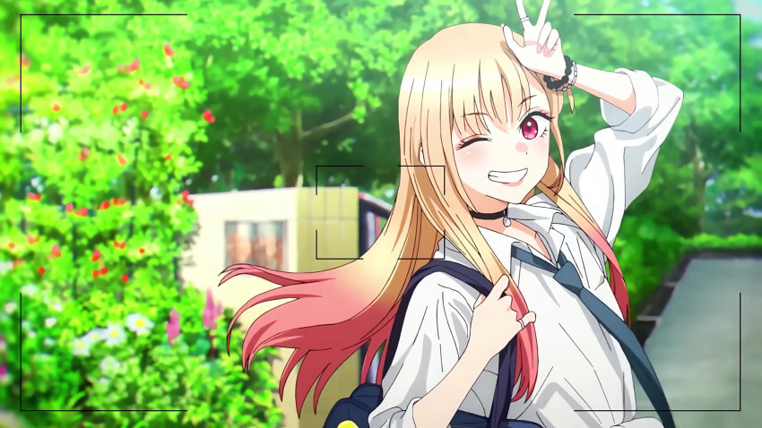

  

---

## ✨ About Me

- 🌱 **Currently Learning**  
  NestJS · Node.js · TypeScript · Solidity · Next.js  
- 💼 **Interests**  
  Blockchain · Smart Contracts · DeFi  
- 👯 **Looking to Collaborate on**  
  DApp · DeFi trading bots (Sniping · Minting)  
- 🥅 **Goal by 30**  
  Create a steady cash flow with my own projects

---

## 🛠️ Tech Stack

| 분야               | 스택                                              |
|------------------|-------------------------------------------------|
| **Languages**    |      |
| **Frameworks**   |      |
| **Blockchain**   |    |

---

## 📈 GitHub Stats

<table>
  <tr>
    <td align="center">
      
    </td>
    <td align="center">
      
    </td>
  </tr>
</table>
